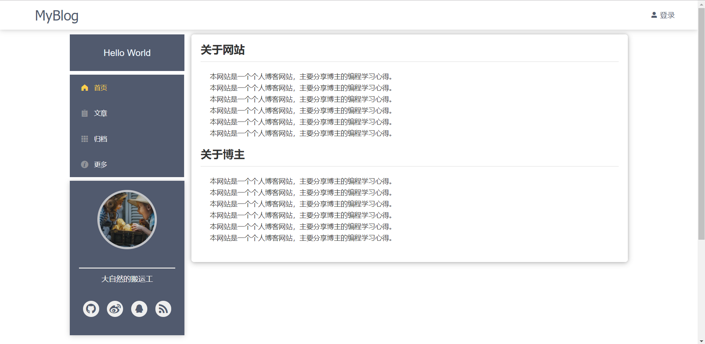
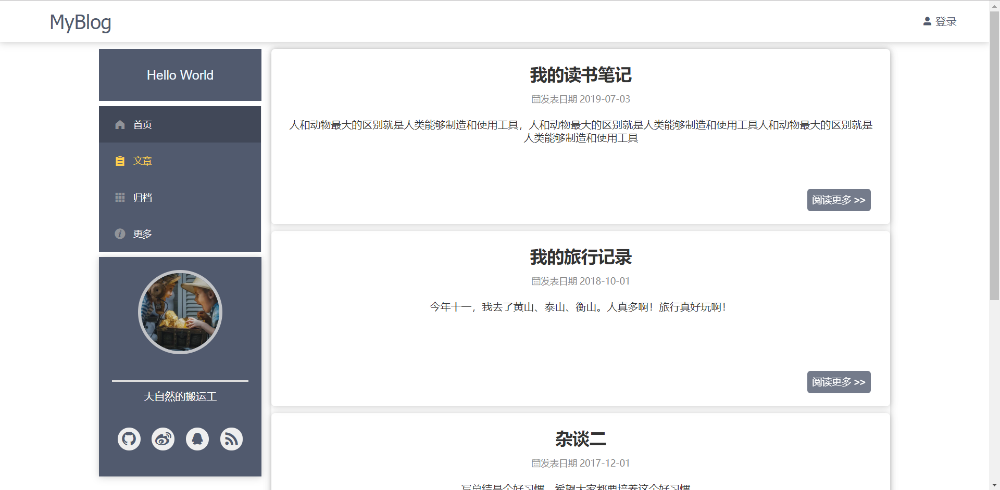
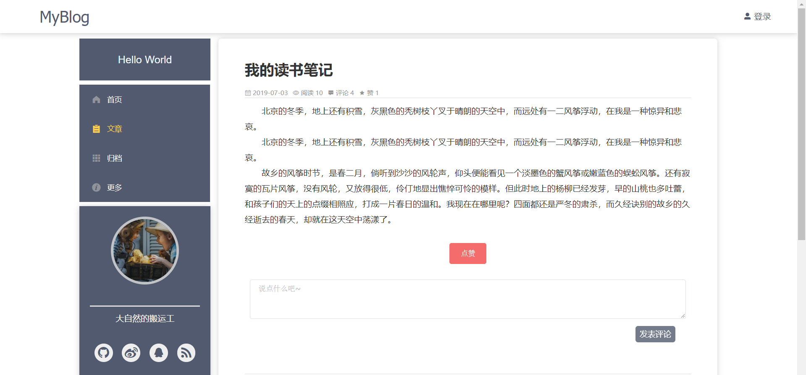
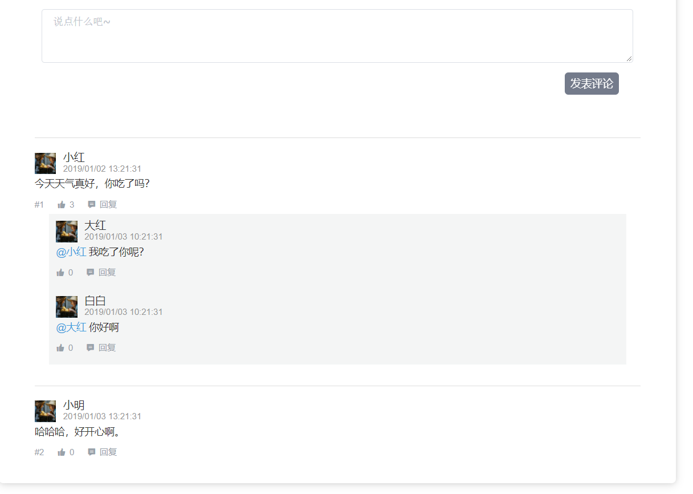
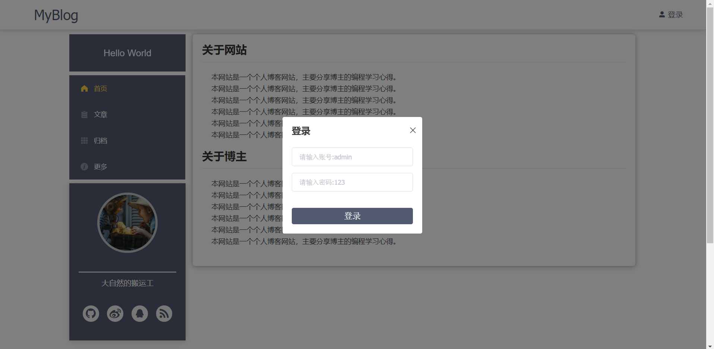
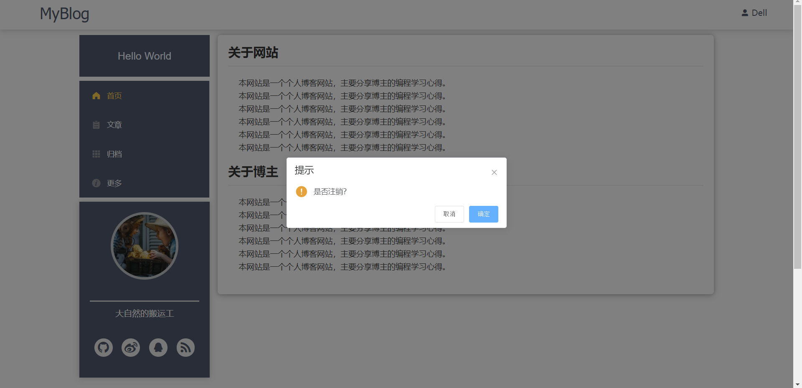

# 基于Vue的单页面个人博客
## 介绍
  
  由于没有后台系统支持，目前博客项目采用的都是 mock 数据
## 效果图

### 首页



### 文章



### 文章详情



### 评论



登录



### 注销



  
## 技术栈
 + Vue.js：基础框架
 + Vuex：公共状态管理
 + vue-router：路由配置
 + axios：发起Ajax请求
 + Mockjs：主要用于拦截Ajax请求
 + elemnt-ui：NavMenu、Message 等制作

 ## 目前实现的功能
 + 路由跳转
 + 文章归档
 + 文章点赞互动
 + 发表文章评论及回复评论功能
 + 登录验证及注销

## 运行
``` bash
# clone 仓库到本地
git clone https://github.com/imliuyeah/vue-blog.git

# 安装依赖
npm install

# 启动项目
npm run dev
```
## License
MIT

